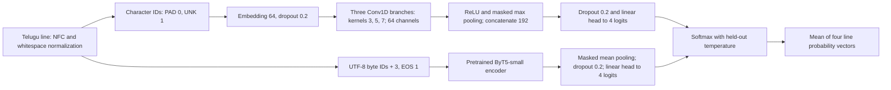

# Chandassu Recognition

Character CNN and ByT5 encoder classifiers for four Telugu poetic metres:
**ఉత్పలమాల · చంపకమాల · మత్తేభము · శార్దూలం**.

The completed models were trained on **NVIDIA H100 NVL**. The CNN is the recommended
small deployment model; both architectures remain supported for training and inference.
Each four-line poem has one label. Training uses line classification, and poem predictions
average the four calibrated line probability vectors.

## Setup

Python 3.12.10 and uv 0.12.10 are used for the release checks. From this repository:

```bash
uv sync --locked --extra cpu
source .venv/bin/activate
python train.py --model_type=cnn
python train.py --model_type=byt5
```

For an x86-64 Linux H100/CUDA 12.8 machine, install with `uv sync --locked --extra cuda`.
Choose one of `cpu` or `cuda`; they are mutually exclusive. macOS uses the native PyTorch
wheel. `--device=auto` selects CUDA, then MPS, then CPU; H100 uses BF16 autocast, CPU/MPS
use FP32. Explicit `--device=cuda --precision=bf16` fails if that backend is unavailable.
The pinned ByT5 base encoder is downloaded on its first training run and cached by
Hugging Face. CNN training needs no model download.

`uv.lock` is authoritative. `requirements.txt` and `requirements-cuda.txt` are generated
CPU/CUDA exports for pip users; install this package afterward with `pip install --no-deps -e .`.
They contain platform markers and hashes. Regenerate them with:

```bash
uv export --locked --extra cpu --no-dev --no-emit-project --emit-index-url -o requirements.txt
uv export --locked --extra cuda --no-dev --no-emit-project --emit-index-url -o requirements-cuda.txt
```

## Training and checkpointing

The commands above perform **one fit each** with the frozen final H100 partitions and
winning initial learning rate. They do not launch a search, nested CV, or an ensemble.
The resolved flat configuration and fit budget are printed before training.

```bash
python train.py --model_type=cnn --config configs/cnn.json \
  --seed=42 --learning_rate=0.0002 --microbatch_poems=8 \
  --effective_batch_poems=16 --epochs=80 --minimum_epochs=24 \
  --output_dir=runs/cnn-seed42

python train.py --model_type=byt5 --config configs/byt5.json \
  --microbatch_poems=4 --effective_batch_poems=16 \
  --gradient_checkpointing --output_dir=runs/byt5-checkpointed
```

All tunable options are top-level flags and top-level JSON keys. Explicit flags override
a preset. `python train.py --help` lists seeds, learning rate, weight decay, dropout,
epoch limits, patience, micro/effective/evaluation batches, encoding capacity, CNN width
and kernels, ByT5 base/revision, scheduler settings, clipping, checkpoint tolerances,
precision/device, shuffle policy, calibration split seed/fraction, and fold count.
Batch sizes count **poems**; each contributes four lines. Effective batch size must be a
multiple of the microbatch size. Partial final updates normalize weighted loss across
all their actual examples. Overlong inputs fail visibly; there is no silent truncation.

Each run writes:

- `run.json`, `partitions.json`: resolved settings, data/code/runtime identity and poem IDs.
- `best.pt`: weights selected by validation **poem Macro F1**, with line CE as a practical tie-break.
- `last.pt`: latest completed epoch, model, optimizer, scheduler, early-stopping state, loader and random states.
- `history.json`, `history.csv`: epoch losses, F1, learning rates and durations.
- `model/`: portable SafeTensors inference package, configuration, vocabulary, calibration and metadata.
- `result.json`: final selection metrics and calibration details.

Resume with the same settings and output directory, adding `--resume`. Interrupted
mid-epoch work is replayed from the previous completed epoch. Resume refuses changes
to data, configuration, implementation or runtime; use a new output directory instead.
Completed runs are verified and reused. Keep `last.pt` to retain resumability.
Cross-backend or cross-hardware bitwise identity is not promised.

To continue training an exported model on more data, supply `--init_checkpoint=PATH`
and a **new** output directory. This starts a new optimizer and run identity while
retaining the model's vocabulary/encoding and architecture. It is separate from resume.
New CNN characters map to UNK; rebuilding its vocabulary requires training a new model.

Plain work-grouped CV is optional and explicit:

```bash
python train.py --model_type=cnn --mode=cross_validate --folds=3 \
  --split_manifest=none --calibration_fraction=0 --split_seed=142 \
  --output_dir=runs/cnn-cv
```

This performs exactly three fits with the supplied settings, using train + validation
works only. Scores are checkpoint-selected validation results, not independent test
estimates. Class coverage is checked before any fit; a bad allocation fails without
silently trying different seeds. The archived H100 study used a different, nested
protocol; this plain-CV mode does not recreate that study's OOF scores.

## Data and sources

| Canonical role | Poems | Lines | Works |
|---|---:|---:|---:|
| Train | 7,425 | 29,700 | 26 |
| Validation | 1,859 | 7,436 | 4 |
| Historical test | 2,234 | 8,936 | 6 |
| **Total targets** | **11,518** | **46,072** | **36** |

The final H100 fits use **6,517** training poems (26,068 lines); **908** train-role poems
(3,632 lines) are held separately for temperature calibration. Validation selects
checkpoints; calibration changes only temperature; historical test is never used by
`train.py`. All four lines stay together. Work/edition groups and layout-equivalent
line duplicates are isolated; authors are not fully disjoint.

[data/v1/WORKS.md](data/v1/WORKS.md) lists all **46** collected works with authors,
URLs, split assignments and supervised counts. Ten have no retained four-class targets.
[data/README.md](data/README.md) defines the prepared JSONL schema and adding data.
Prepared target files preserve the final corpus's poem text, labels and provenance.
Other/unknown poems are retained separately for research; they are not trained as a
fifth class. Raw HTML, scrapers, audit response caches and notebooks are local archives.

## Architectures



The CNN has **68,420** parameters with the frozen fit vocabulary. The ByT5 encoder/head
has **217,663,364** parameters. ByT5 is an encoder classifier here, not a generative
model or a structured prosody reasoning model. Base:
[`google/byt5-small`](https://huggingface.co/google/byt5-small), pinned revision
`68377bdc18a2ffec8a0533fef03b1c513a4dd49d`.

| Final H100 setting | CNN | ByT5 |
|---|---:|---:|
| Initial learning rate | 1e-4 | 3e-5 |
| Microbatch poems / effective poems | 16 / 16 | 8 / 16 |
| Evaluation batch poems | 16 | 8 |
| Maximum / minimum epochs | 60 / 24 | 32 / 8 |
| Early-stopping patience | 12 | 8 |
| Encoding limit | 256 characters | 1,024 byte tokens including EOS |
| Gradient checkpointing | off | off |
| Selected epoch, seed 17 | 59 | 17 |

Both use AdamW, weight decay 0.01, dropout 0.2, gradient clipping 1.0, and
ReduceLROnPlateau on validation unweighted line CE (patience 4, factor 0.5, floor 1e-6).
Checkpoint F1 tolerance is 1e-6; line CE tie-break tolerance is 1e-4. Training poem order
is fixed by default. Final seeds were **17, 42, 73**. Saved H100 runtime: Python 3.12.3,
PyTorch 2.8.0+cu128, Transformers 4.57.6, scikit-learn 1.6.1. The new environment also
pins its numerical and serving dependencies; it is not claimed to be the original
machine image. The original configurations/hashes remain in results/v1/identity.json.

## Completed results

[results/v1](results/v1) contains the complete H100 reports, **folds 1–3**, all six
final seed recipes, epoch histories, CSVs, figures and historical logits. No weights
are tracked. The manifest records imported file hashes; original H100 paths in the
reports are retained verbatim for provenance.

| Measure | CNN | ByT5 |
|---|---:|---:|
| Source-annotated grouped OOF poem Macro F1, mean across seeds | 0.997130 | 0.997137 |
| Historical poem accuracy, each final seed | 2,234 / 2,234 | 2,233 / 2,234 |
| Historical poem Macro F1 | 1.000000 | 0.999619 |

The paired development comparison supports practical equivalence within the study's
0.002 F1 margin; CNN was preferred for deployment cost. Historical data had already
been inspected during earlier project development, so these are **diagnostic results,
not a fresh blind benchmark**. Labels are source annotations plus documented rule
inference/verification, not independent expert gold. Per-class, line, calibration,
work and rejection metrics are in the full reports. External quotation probes are
exploratory and do not establish a new representative benchmark.

Reliable rejection of other metres failed for both models. High probability does not
prove a poem belongs to one of these four classes. Neither model provides syllabification,
Guru/Laghu sequences, gaṇas, or a statistical confidence interval for an individual poem.
The study's aggregate bootstrap comparison intervals are a different quantity.

## Inference and Hugging Face export

`inference.py` serves the original light paste interface, with a **light/dark toggle**,
and JSON API using the same model loader as training. It supports **single-model and
equal-probability ensemble inference**. Model weights remain outside Git. Convert the completed H100 seed-17 models
locally; the seed is fixed in advance rather than picked using historical test scores:

```bash
python scripts/export_model.py --bundle ~/Downloads/chandassu-models \
  --model_type=cnn --seed=17 --output_dir=models/cnn
python scripts/export_model.py --bundle ~/Downloads/chandassu-models \
  --model_type=byt5 --seed=17 --output_dir=models/byt5
python inference.py --model_dir=models/cnn --strategy=single --port=8765
```

Open <http://127.0.0.1:8765>. API: `GET /health`, `GET /api/info`, `POST /api/predict`
with `{"text":"four lines separated by newlines"}`. Responses include the winning class,
all class probabilities, per-line predictions/raw logits, agreement, score margin,
entropy, unseen-character fraction for CNN, temperature and latency. A single line
is also accepted. Invalid line counts or overlong inputs return 422.

To load all three already-trained CNN seeds and start with their ensemble:

```bash
for seed in 17 42 73; do
  python scripts/export_model.py --bundle ~/Downloads/chandassu-models \
    --model_type=cnn --seed="$seed" --output_dir="models/cnn-seed-$seed"
done
python inference.py --model_dirs models/cnn-seed-17 models/cnn-seed-42 models/cnn-seed-73 \
  --strategy=ensemble --port=8765
```

Use `--strategy=single` with those same directories to start with the first seed instead.
The UI selector can switch among any loaded seed and their ensemble without restarting.
The API accepts an optional `"strategy":"ensemble"` or `"strategy":"seed-42"`; omission
uses the CLI default, and `"single"` means the first loaded seed. Ensemble mode requires
at least two distinct seeds from one model family. It averages each member's separately
temperature-calibrated probabilities, never raw logits. Each seed's raw logits remain
in the response. The displayed range compares loaded seed scores and is **not a
confidence interval**. All loaded seeds are evaluated for the range even in single mode;
use one `--model_dir` for the lowest latency. The same flags support ByT5 packages, with
substantially larger memory requirements per loaded seed. The theme toggle remembers
your preference in this browser; the default is light.

Upload **each exported folder's contents** through the Hugging Face website into a
separate model repository. Include the SafeTensors weights, JSON files, model card,
LICENSE and NOTICE together. These are custom packages; the generic Transformers
AutoModel/pipeline interface is not supported. No pickle is needed for inference.
After upload, serve an immutable Hub revision:

```bash
python inference.py --model_id=YOUR_ACCOUNT/YOUR_MODEL --revision=FULL_40_CHARACTER_COMMIT_ID
python scripts/evaluate.py --model_dir=models/cnn --output=runs/historical-diagnostic.json
```

Evaluation is an explicit, separate operation and does not update a checkpoint or
select a recipe. Use `--input=independent-poems.jsonl` for independent labelled poems.

## Docker and checks

```bash
docker build --target test -t chandassu:test .
docker build --target cpu -t chandassu:cpu .
docker run --rm -p 127.0.0.1:8765:8765 \
  -v "$PWD/models:/app/models:ro" chandassu:cpu

# On an x86-64 Linux CUDA host with NVIDIA Container Toolkit:
docker build --target cuda -t chandassu:cuda .
docker run --rm --gpus all -v "$PWD/runs:/app/runs" \
  -v "$HOME/.cache/huggingface:/home/app/.cache/huggingface" \
  chandassu:cuda python train.py --model_type=byt5 --device=cuda --precision=bf16

uv run --locked --extra cpu pytest -q
uv run --locked --extra cpu ruff check src tests scripts train.py inference.py
uv run --locked --extra cpu ruff format --check src tests scripts train.py inference.py
```

Images include the prepared data and code, and omit local weights, notebooks, HTML
caches and the archived collection pipeline. Bind-mounted output/cache folders must
be writable by container UID 1000; use `--user` to match your host account if needed.
The GPU target is intended for x86-64 H100 systems; GPU training cannot be validated on
this Mac. The CPU test stage runs both architectures using a tiny local ByT5 configuration.

## Licensing and repository scope

Code is **Apache-2.0**; see [LICENSE](LICENSE) and [NOTICE](NOTICE). Poetry, annotations
and source editions have separate provenance and rights status in
[data/LICENSE.md](data/LICENSE.md). The code license does not relicense the dataset.

Only the supported training/inference implementation, prepared data, complete final
results and concise documentation belong to this Git tree. [archive/README.md](archive/README.md)
describes the local preservation area. Scrapers, source HTML, old notebooks, GX10 helpers,
partial results and superseded plans remain on disk and are excluded from tracking.
The original structured-reasoning research direction is documented in
[docs/project_brief.md](docs/project_brief.md); Model B remains future work.
